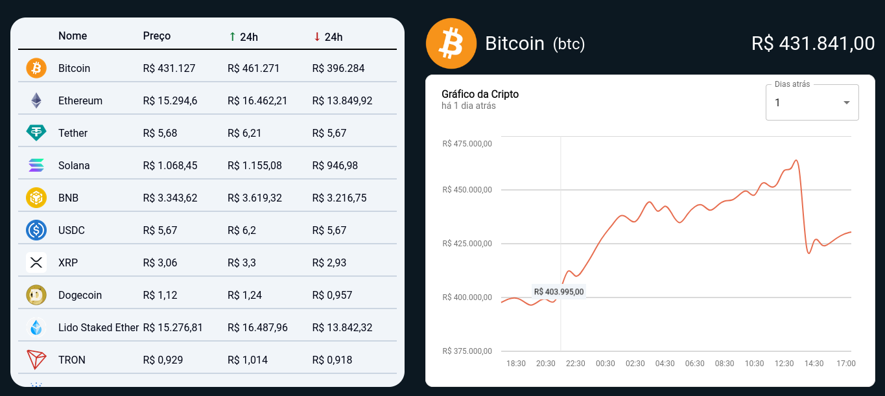

# Cripto



[`Clique para visitar o projeto`](https://cripto-gabrielgal.vercel.app)

## Descrição

O **Cripto** é um projeto que permite visualizar o desempenho de diversas criptomoedas em tempo real. Utilizando gráficos interativos, você pode acompanhar a variação de preços, a performance e muito mais! A plataforma utiliza a API do **CoinGecko** para obter dados de criptomoedas atualizados, e exibe essas informações com a ajuda da biblioteca **Shadcn Charts**.

## Tecnologias Usadas

- **Tailwind CSS**: Framework de CSS que facilita a criação de interfaces com um design moderno e responsivo.
- **Shadcn Charts**: Biblioteca JavaScript para a criação de gráficos interativos, utilizada para mostrar o desempenho das criptos.
- **CoinGecko API**: API que fornece dados em tempo real sobre o mercado de criptomoedas, incluindo preços, volume de mercado e muito mais.

## Funcionalidades

- Visualização dos preços das criptomoedas.
- Gráficos interativos com a variação de preços.

## Como Usar

### 1. Clone o repositório:

```bash
git clone https://github.com/seu-usuario/cripto.git
```

### 2. Acesse o diretório do projeto:

```bash
cd cripto
```

### 3. Instale as dependências:

```bash
npm install
```


### 4. Execute o servidor de desenvolvimento:

```bash
npm run dev
```

### 5. Acesse o projeto no navegador: http://localhost:3000